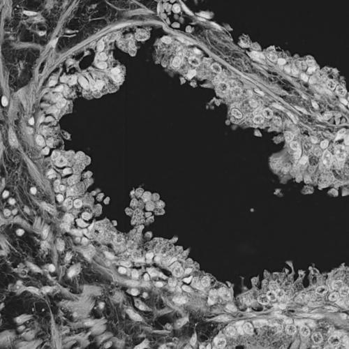
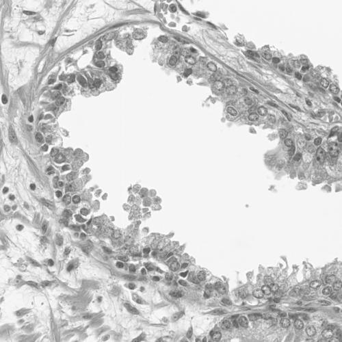
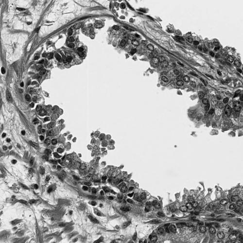
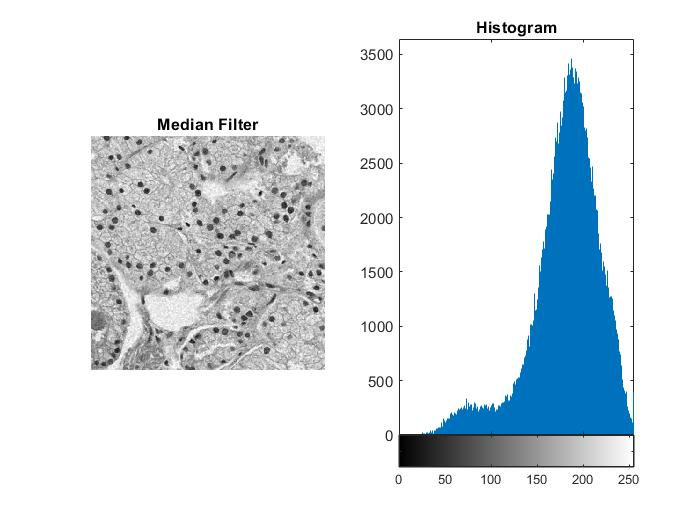

# Digital Image Processing in MATLAB

A practical **Digital Image Processing** project implemented in MATLAB.  
The repository demonstrates fundamental techniques for image enhancement, noise removal, segmentation, and mathematical morphology.

## Project Overview

The project applies several digital image processing techniques to sample images and visualizes the results using MATLAB figures and histograms.

Main topics covered:

- Point / intensity transformations
- Contrast enhancement
- Gaussian noise and filtering
- Salt & pepper noise and filtering
- Threshold-based segmentation
- Morphological operations
- Boundary extraction

## Techniques Implemented

### 1. Intensity Transformations

| Technique | MATLAB Script |
|---|---|
| Negative transformation | `Negative_Transformation.m` |
| Log transformation | `Log.m` |
| Gamma / power-law transformation | `Gamma.m` |
| Contrast stretching | `Contrast_Stretching.m` |
| Piecewise-linear transformation | `Piecewise_Linear.m` |

### 2. Noise & Spatial Filtering

`GaussianNoise.m` demonstrates:

- Gaussian noise generation
- Average / box filter
- Arithmetic mean filter
- Harmonic mean filter
- Median filter

`SaltPepperNoise.m` demonstrates:

- Salt & pepper noise generation
- Median filter
- Maximum filter
- Minimum filter
- Average / box filter
- Histogram comparison

### 3. Segmentation & Morphology

`project_Part3.m` performs the following pipeline:

```text
Original Image
      ↓
Grayscale Conversion
      ↓
Otsu Thresholding
      ↓
Erosion
      ↓
Boundary Extraction
      ↓
Dilation / Boundary Thickening
```

The threshold is calculated using Otsu's method (`graythresh`) and then adjusted before converting the image to binary form.

## Example Results

### Point Transformations

<p align="center">
  
  
  
</p>

### Gaussian Noise Filtering

<p align="center">
  
  
</p>

### Salt & Pepper Noise Filtering

<p align="center">
  
  
</p>

## Repository Structure

```text
Digital-Image-Processing-MATLAB/
│
├── Contrast_Stretching.m
├── Gamma.m
├── GaussianNoise.m
├── Log.m
├── Negative_Transformation.m
├── Piecewise_Linear.m
├── SaltPepperNoise.m
├── Thresholding.m
├── project_Part3.m
│
├── ts1.jpg
├── ts10.jpg
├── ttrrr.png
│
├── results/
│   ├── point-transformations/
│   └── noise-filtering/
│       ├── gaussian/
│       └── salt-pepper/
│
├── docs/
│   ├── project/
│   └── course-notes/
│
└── README.md
```

## Requirements

- MATLAB
- Image Processing Toolbox

The project uses functions including:

```matlab
rgb2gray
imnoise
imhist
medfilt2
ordfilt2
fspecial
imfilter
graythresh
imbinarize
strel
imerode
imdilate
```

## How to Run

### 1. Clone the repository

```bash
git clone https://github.com/YazAj/Digital-Image-Processing-MATLAB.git
```

### 2. Open the project folder in MATLAB

Set `Digital-Image-Processing-MATLAB` as the MATLAB **Current Folder**.

### 3. Run a script

For example:

```matlab
Gamma
```

or:

```matlab
GaussianNoise
```

or:

```matlab
project_Part3
```

The input images are stored in the repository root, so the scripts can use their existing relative paths.

## Input Images

- `ts1.jpg` — used for image transformation experiments
- `ts10.jpg` — used for noise and filtering experiments
- `ttrrr.png` — used for thresholding and morphology

## Notes

- `Thresholding.m` is retained from the original project but is currently empty.
- Thresholding and morphology are implemented in `project_Part3.m`.
- Generated result images are organized under `results/` for easy comparison.
- Supporting project documents and course material are stored under `docs/`.

## Learning Objectives

This project demonstrates how fundamental Digital Image Processing concepts can be implemented programmatically in MATLAB, including enhancement, restoration, segmentation, spatial filtering, histogram analysis, and morphology.

---

**Built with MATLAB for Digital Image Processing coursework.**
